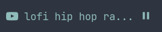

# polybar-media-control
A highly customizable media control script for [Polybar](https://github.com/jaagr/polybar).
The script is designed to be used out of the box and customised without having to work on the code.
Feel free to share any opinion or improvement!

 

## Dependencies
* [python3](https://www.python.org)
* [dasbus](https://github.com/rhinstaller/dasbus)
* [Plasma Browser Integration](https://community.kde.org/Plasma/Browser_Integration)
* [Google Material Icon Font](https://github.com/google/material-design-icons) (needed for the default configuration)

## Examples
Spotify:
```ini
[module/spotify]
type = custom/script
inherit = module/base
interval = 1
exec = /path/to/media-control.py spotify -i      -t 20 -f '{prev} {media} {song} {play_pause} {next}'
exec-if = pgrep spotify -x ; Not needed to work, save resources when spotify is closed
```

Plasma browser integration:
```ini
[module/browser]
type = custom/script
inherit = module/base
interval = 1
exec = /path/to/media-control.py browser -i  _    --icons-fonts 2 _ 2 2 2 -t 15 -f '{media} {song} {play_pause}'
exec-if = pgrep plasma-browser-integration-host -f ; Not needed to work, save resources when the browser is closed
```

## Arguments
```
usage: media-control.py [-h] [-f FORMAT] [-i ICONS ICONS ICONS ICONS ICONS] [--icons-fonts ICONS_FONTS ICONS_FONTS ICONS_FONTS ICONS_FONTS ICONS_FONTS] [-t TRUNCLEN] [-q]
                        {spotify,browser}

positional arguments:
  {spotify,browser}     Media to be controlled, is the only required argument

options:
  -h, --help            show this help message and exit
  -f FORMAT, --format FORMAT
                        Output format, components are {prev} {next} {play_pause} {media} {artist} {song}, default -> {prev} {media} {artist}: {song} {play_pause} {next}
  -i ICONS ICONS ICONS ICONS ICONS, --icons ICONS ICONS ICONS ICONS ICONS
                        Icons to display (in order): prev media play pause next, use _ to skip and use the default one
  --icons-fonts ICONS_FONTS ICONS_FONTS ICONS_FONTS ICONS_FONTS ICONS_FONTS
                        Index of the font to use with the icons (in order): prev media play pause next, use _ to skip and use the default one
  -t TRUNCLEN, --trunclen TRUNCLEN
                        Max length of each label (artist and song)
  -q, --quiet           If set, don't show any output when the current song is paused
```
### Format components details:
- **{prev}:** previous song icon button
- **{media}:** media icon
- **{artist}:** artist name
- **{song}:** song name
- **{play_pause}:** play/pause icon button
- **{next}:** next song icon button

**NOTE:** {prev} and {next} buttons will be omitted if the media doesn't support them

## Planned features
- Live position tracker in the underline/overline (if supported)
- Album component
- Optional build script to generate a custom script configuration and improve performance
